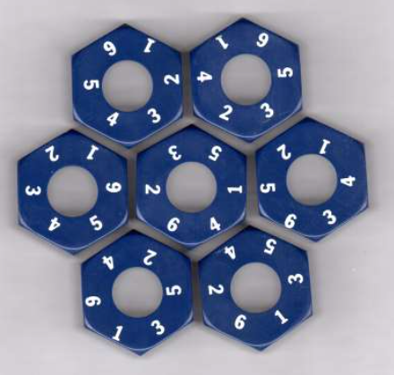
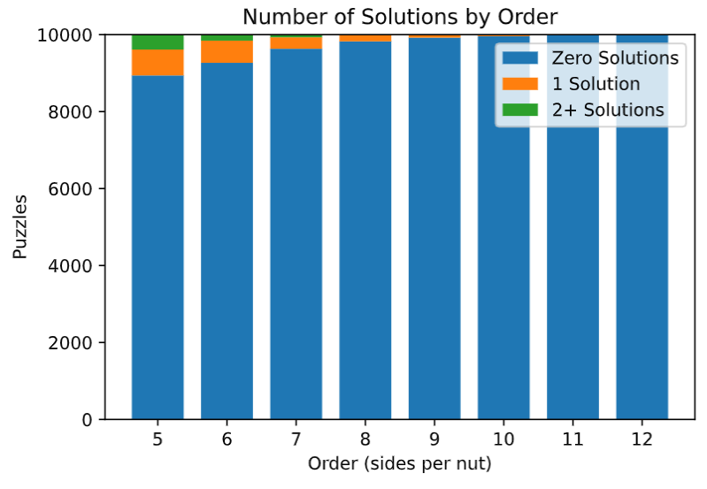

# FAI Homework 1: Drive Ya' Nuts

### By Ari Porad

# Introduction

I originally wrote this project for Brandeis University's COSI 101A _Fundamentals of Artificial Intelligence_, which I took in Spring 2021 with Professor Jordan Pollack (referred to by me and me alone as the Olin-eqsue _FAI_, pronounced _/faye/_).

The assignment revolved around building an algorithm to solve puzzles in the following form (from [the assignment](assignment.pdf)):

> There are n+1 regular polygons with n sides, each a permutation of the n numbers (or colors or shapes) on each side. The problem is to arrange the polygons in a ring with one in the center, such that the numbers on each adjacent edge will match. In the commercial version, there are 7 pieces, each with 6 possible rotations, and hexagons tile the plane. But we can generalize. 4 triangles would fold up to a pyramid, 5 squares give you 5/6ths of a cube, 6 pentagons give you a bowl, and so on, even though 11 decagons or 13 dodecagons will not tile or fold up.



Most of the contents of this document can also be found in the original report that I turned in, which also includes some example program output ([Jupyter Notebook](report.ipynb), [PDF](report.pdf)). Additionally, the thoroughly-documented source code can be found in this repo (mostly in [main.py](main.py), with a few not-that-interesting helpers in [helpers.py](helpers.py)). Some discussion of my approach follows.

## Overview

For this homework, I built a puzzle solver based on a depth-first search of the tree of possible puzzle states. For a given puzzle, the state tree is initialized with a root state, which specifies that all nuts are yet to be placed. From the root state, the solver iteratively generates the successor states of the current state and pushes them onto the stack of states to be evaluated, thereby conducting a depth-first search with appropriate backtracking. An iterative design is used over a recursive one in order to avoid stack overflow errors, which occurred continuously under a previous recursive design. The successor states of a given game state is the set of all immediately available moves (ie. all possible ways to place one additional nut).

A state is represented by an instance of the `State` class. A key design decision in this solver is that an incomplete state and a complete solution are represented by the same object, and consequently most properties of a `State` may be `None` (as a practical matter, lists default to an empty list instead of `None`). A `State` contains the center nut, a list of nuts to place, a list of nuts that have been placed, a reference to the parent state, and various methods. A `State` can be (in)valid and/or (in)complete. An invalid `State` is one that breaks a rule (for example, two nuts are touching, but the numbers on the touching edges don't match), while a complete `State` is one where all nuts have been placed. Importantly, these distinctions are entirely independent. In order to ensure that a `State` can represent either a partial solution or a complete one, a state can be complete but invalid or vis versa. A `State` constitutes a solution to the puzzle if it is both valid and complete. In line with the Pythonic design principle of "ask forgiveness, not permission," the system doesn't try to only generate valid states. Instead, the system generates all possible next states (while making a significant effort to avoid duplicates for performance reasons), then discards those which are invalid. This drastically simplifies things without enduring a noticeable performance hit.

A significant effort has been made to optimize the performance of this solver. To that end, the algorithm for detecting invalid states (therefore pruning them from the state tree) has been optimized to detect not only any illegal state, but also any state that could not possibly have a valid solution for any set of nuts. (Most notably, where a nut would need to have the same number twice to fit with its neighbors, which is obviously impossible.) Additionally, the subsystem which deals with puzzle generation has been optimized to generate permutations entirely lazily, therefore eliminating the need (particularly with higher-order problems) to generate large series of permutations before selecting a puzzle. In total, these optimizations have resulted in a performance increase of several orders of magnitude for 6th-order puzzles, and has made higher-order puzzles (ex. n = 12) solvable in reasonable time at all.

## Puzzle Generation

To generate new puzzles, we have the `generate_puzzle(n)` function, which randomly generates a puzzle of order `n` (ie. `n + 1` `n`-agons). Conceptually, it does so by permuting all possible combinations of the set of integers from `1` to `n` (inclusive) in a random order and taking the first `n + 1`, then canonicalizing them (rotating them so that the `1` is in the first position).<sup>1</sup> In practice, it uses a series of optimizations (documented throughout the code in comments) to speed the process up by over an order of magnitude.

<sup>1</sup> It should be noted, for the purposes of understanding printed output, that there is one (and only one) case in which nuts are not stored in canonicalized form: once a nut has been placed, it is rotated such that its first element is the number touching the center, and subsequent elements go around the nut clockwise.

## Solving & Pruning

My solving algorithm uses a depth-first search algorithm with aggressive pruning to achieve reasonable performance. It starts with a root state (representing that all nuts need to be placed), and prunes any state that is invalid or breaks any rule. Child states of any pruned state are not explored. Depth-first search was chosen because it's guaranteed to find a solution if one exists, but does so reasonably performantly. Additionally, because the puzzle in question is dissipative, loops are not a concern.

The pruning algorithm can be disabled by calling `solve_puzzle(nuts, prune=False)`, which serves no purpose other than to make it far, far slower. In some light testing, disabling pruning increases solve time by ~5x for an n = 6 puzzle.

## Counting & Graphing

By calling `solve_puzzle(nuts, all=True)`, the solver can be configured to find all possible solutions to a problem instead of just the first one. This obviously increases the runtime substantially, but allows some interesting analysis. Additionally, the function `solvability_analysis(n)` performs some analysis on a large number (1000 by default, but configurable with the `rounds=` parameter) of randomly-generated puzzles of degree `n`, counting the number of solutions that each one has and returning some summary statistics. In conducting this analysis, there would occassionally be puzzles that had substantially more solutions than average. In particular, there were occasionally `n = 6` puzzles with 6 solutions. Once, there was the following 6th-order puzzle with _eight_ solutions, which I thought was impressive. These results can be seen in more detail in the report ([Jupyter Notebook](report.ipynb), [PDF](report.pdf)).



## Unit Testing

Most of the program's important logic is unit-tested using the lightweight Python module [doctest][]. To run them, do either of the following (both output nothing test-related unless one or more tests fail):

```bash
# Preferred, runs tests for helpers too.
$ python3 -m doctest *.py

# For convenience, runs tests for the main file only (which is most of the important
# ones), then runs the program itself.
# NOTE: This will continue to run the solving algorithm even if the tests fail,
# although the failures will be logged to the console.
$ python3 main.py
```

[doctest]: https://docs.python.org/3/library/doctest.html 'Python doctest'
