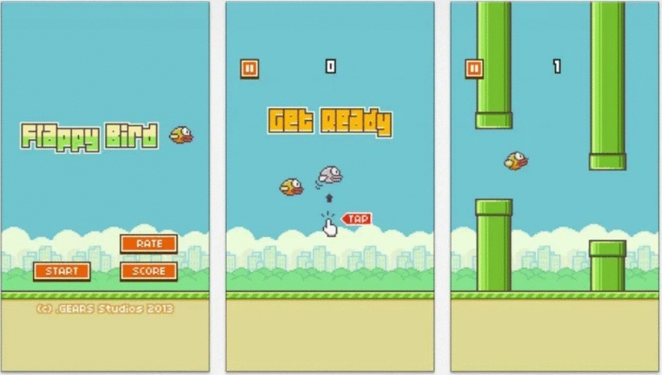
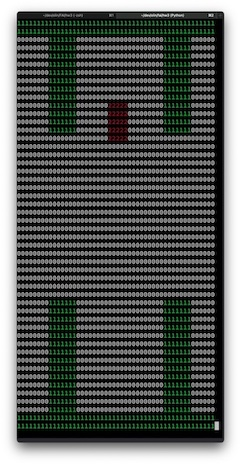

# FAI Homework 3: Deep Flappy Bird

### By Ari Porad

## Introduction

I originally wrote this project for Brandeis University's COSI 101A _Fundamentals of Artificial Intelligence_ in Spring 2021 (referred to by me and me alone as the Olin-eqsue _FAI_, pronounced _/faye/_).

The assignment revolved around training a Deep Q Network (DQN) to play the game Flappy Bird. This involved building a simulation of the game, and adding a small amount of code to implement the epsilon-greedy exploration strategy (the majority of the neural network implementation--which was built on top of TensorFlow--was provided as part of the assignment). I then trained the network to play Flappy Bird, both with and without pipes. This approach was inspired by [Mnih et al.][dqn-paper], who successfully used a DQN to play classic Atari games in much the same fashion.


_The original Flappy Bird. This screenshot taken from the assignment._

Most of the contents of this document can also be found in the original report that I turned in ([Jupyter Notebook](report.ipynb), [PDF](report.pdf)). Additionally, the thoroughly-documented source code can be found in this repo (my additions can be found in [env.py](env.py) and [dqn.py](dqn.py)). Some discussion of my approach follows.

[dqn-paper]: dqn-paper.pdf 'Mnih et al.: Playing Atari with Deep Reinforcement Learning'

## Implementation

### Flappy Bird Environment



_My simulated flappy bird environment. A friend suggested that it ought to be called "Jumpy Rectangle."_

I built an environment that simulates the Flappy Bird game so that the neural network could be easily trained against it. The environment simulates a Flappy Bird game as a series of discrete time steps (_frames_). The environment lives in [`env.py`](env.py), and the specifications are as follows:

-   A frame is 50x50px, where each pixel is either `0` (empty air), `1` (a wall or pipe), or `2` the bird. The origin of the frame's coordinate system is at the top left of the screen.
-   Each frame has a 2px tall border along the entire top and bottom of the frame (the ceiling and floor, respectively).
-   There are up to 2 pipes on the screen at each time, separated by a horizontal distance of 22px. Each pipe is 7px wide.
-   Pipes move leftward at 1px/frame, entering from the right and exiting to the left. The first pipe starts 1px off the right edge of the screen, therefore becoming visible on the 2nd frame. Ergo, the second pipe is 22+7 = 29px off the right edge of the screen.
-   Once a pipe has fully disappeared offscreen to the left, it is reintroduced from the right edge of the screen after 1 frame (ie. there is one frame where the pipe is not visible onscreen).
-   Pipes are split in half vertically, with a 20px gap.
-   In deterministic mode, both halves of each pipe are always the same length, 13px (excluding the border). Otherwise, the top half each pipe is assigned a random length between 3px and 22px (excluding the border). The bottom half of the pipe is sized to maintain the 20px gap.
-   The bird is 5x5px. Its left edge is always in the 23rd column of pixels.
-   The bird's vertical position is adjusted by its velocity every frame. The bird's velocity starts at 0px/frame and accelerates by 2px/frame/frame downward by gravity each frame where the screen is not tapped. When the screen is tapped, the bird's velocity is reset to 5px/frame upwards (and no gravitational acceleration applies for that frame).
-   At each time step, the environment returns an _observation_, which is composed of the most recent four frames. It also returns the neural network's reward (`-1` if the bird has crashed, `1` if it has just cleared a pipe, or `0` otherwise), and if the bird has crashed (which ends the episode).

The code is thoroughly documented, so I won't spend much time elaborating on it here. However, there are some details worth highlighting:

-   Most environment logic is in the stateless, immutable dataclass `Frame`.
-   I generally live by the maxim "design your model so that illegal states are unrepresentable" (that's a rough quote from someone), and that's true here: each `Frame` only stores the height and velocity of the bird and the height and position of each pipe. It uses this information to render the full 50x50px integer array on demand.
    -   That array is recreated every time to reduce the likelihood of corrupting data.
-   Because `Frame`s are immutable, a new one needs to be created for each time step. Each `Frame` is responsible for generating—but not keeping track of—its successor frame.
    -   Because `Frame`s are stateless, `frame.next(...)` doesn't check if the game has already ended—that's a concern of `FlappyEnv`. If you wanted, you could keep calling `frame.next(...)` forever, although that behavior is undefined.
    -   In order to properly generate the next `Frame`, `frame.next(...)` takes both the player's action and a function that generates a pipe height. Those arguments aren't the cleanest from a separation-of-concerns perspective, but seemed like the right trade off in terms of simplicity.
-   NumPy arrays are used for representing rendered frames, because they offer vastly superior multi-dimensional indexing as compared to nested lists.
-   `FlappyEnv` is a wrapper around `Frame` that keeps track of the last 4 `Frame`s to allow providing a full 4-frame observation. It also implements the required API.
-   [`config.py`](config.py) stores all parameters for the game.

### Deep Q Network (DQN)

I also implemented the epsilon-greedy training strategy for the DQN. Epsilon-greedy forces the network to explore alternative options by picking a random choice a fixed proportion of the time (in our case, 5%). This allows the network to discover possibilities it otherwise would have never explored.

## Results

The results of training the DQN to play Flappy Bird are discussed in more detail in the report ([Jupyter Notebook](report.ipynb), [PDF](report.pdf)), but I'll summarize them here.

### No Pipes

The network quickly learned to fly, first making it all the way through an episode around its 60th attempt (although Flappy Bird is theoretically infinite, each episode was capped at 250 frames during training for the no-pipes configuration). It continued to explore alternate possibilities (as is intended with an epsilon-greedy strategy) for another ~40 episodes, before having fully learned to the point that it always completed the episode. This noise is an inherent part of epsilon-greedy training, and is expected.

The best-performing iteration of the flight-only network is able to fly the flappy bird indefinitely. It immediately raises the bird to the very top of the frame (1px away from the ceiling), presumably so as to give it the most time to recover in the event that epsilon-greedy forces the agent to fail to cause the bird to jump when it ought to. Interestingly, this doesn't seem to account for the fact that epsilon-greedy could also force the agent to cause the bird to jump when it shouldn't, and therefore crash into the ceiling. More experimentation would be required to fully understand this behavior.

Once the bird is in position, the agent continuously keeps the bird as close to the top as it can (ie. allowing it to fall just far enough that a tap won't result in it crashing into the ceiling). This oscillation behavior makes sense, as the network is acting deterministically for all possible states within that loop (and therefore has no mechanism to break out of it).

Conceivably, this means the same behavior as the DQN agent could be achieved with the following pseudocode (more complete investigation would be needed to determine if this would actually be equivalent in all cases):

```
Forever:
    # Tap the screen unless doing so would crash into the ceiling
    If CurrentBirdHeight > THRESHOLD (≈ HeightOfCeiling - HeightOfBird):
        Do Nothing
    Else:
        Tap the Screen
    End
End
```

### With Pipes

The additional complexity and training duration of this configuration produces far more interesting data. While the network did learn significantly, its performance remained extremely noisy and unstable. This is to be expected of an epsilon-greedy training strategy, and is needed for the network to explore new paths it otherwise wouldn't.

The best-performing iteration of the with-pipes network is able to play full Flappy Bird indefinitely, successfully avoiding obstacles—including randomized pipes. By virtue of the drastically higher complexity of the with-pipes configuration, no other patterns in the agents behavior are easily visible. These results demonstrate strong learning, and consequently the viability of a DQN for playing Flappy Bird.

## Conclusion

For this homework, I built a Flappy Bird simulation environment and implemented the epsilon-greedy strategy for a Deep Q Network (DQN). I then trained the network on the Flappy Bird game, both with and without pipes, exclusively using the game's visual pixel output as the network's input. The network successfully learned to play the game, to the point that it could continue to play indefinitely (including with randomly-generated pipes).

During training, the epsilon-greedy strategy results in noisy performance. This is entirely congruent with Mnih et al.'s results from training a DQN to play classic Atari games exclusively from pixel input, who also found DQNs to be highly effective but with noisy rewards in training.
